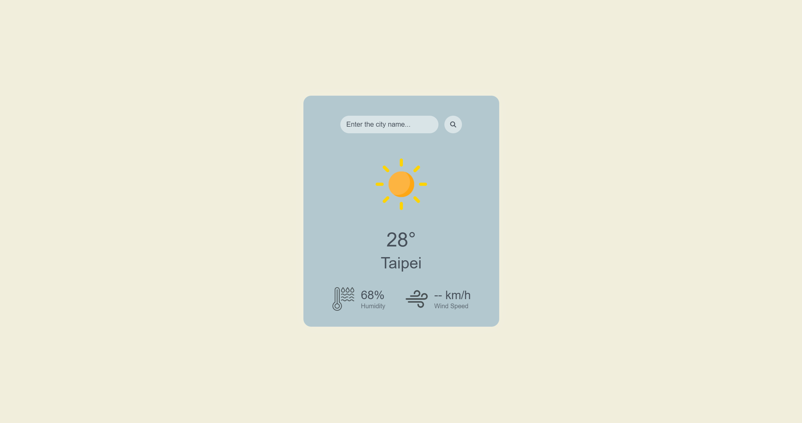

# ☀️ Weather App 天氣查詢小工具

這是一個以低飽和奶油藍色系為主題設計的天氣查詢網站，使用 HTML、CSS 與 Vanilla JavaScript 開發，並透過 OpenWeatherMap API 取得即時天氣資料。

使用者可查詢全球城市的天氣資訊，包含溫度、濕度、風速與天氣狀態圖示，並以簡潔舒適的卡片式介面呈現。

🔗 **作品展示（點我使用）**：  
👉 [https://iiijen.github.io/Weather-App/](https://iiijen.github.io/Weather-App/)

**作品預覽**

---

## 🔥 功能介紹

- 🔍 查詢天氣（輸入城市名稱）
- 🌡 顯示即時溫度（攝氏）
- 💧 顯示濕度百分比
- 🌬 顯示風速（km/h）
- 🌥 顯示天氣圖示（依天氣狀況自動切換）
- 📱 響應式設計，手機也能正常顯示

---

## 🛠 技術細節

- HTML + CSS + JavaScript 原生技術（Vanilla JS）
- 使用 OpenWeatherMap API 串接天氣資料
- fetch + DOM 操作渲染資料
- 圖示依據天氣條件動態切換
- 具備錯誤處理機制（自動載入預設圖）
- CSS Variables 主題色管理
- Flexbox 響應式排版

---

## 未來規劃

- 錯誤提示訊息顯示於畫面
- Loading 動畫效果
- 自動定位目前所在城市
- 顯示當地日期與時間
- 攝氏／華氏切換
- 未來 3~5 天天氣預報

---

## 學習成果

透過本專案練習：

- JavaScript 非同步資料處理（Fetch API）
- RESTful API 串接
- DOM 操作與資料渲染
- 錯誤處理機制
- CSS Flexbox 排版
- 響應式網頁設計（RWD）
- UI 配色與介面設計
- 前端專案結構規劃

## 🧑‍💻 開發者資訊

作者：艾蓁（iiijen）  
GitHub：[@iiijen](https://github.com/iiijen)
